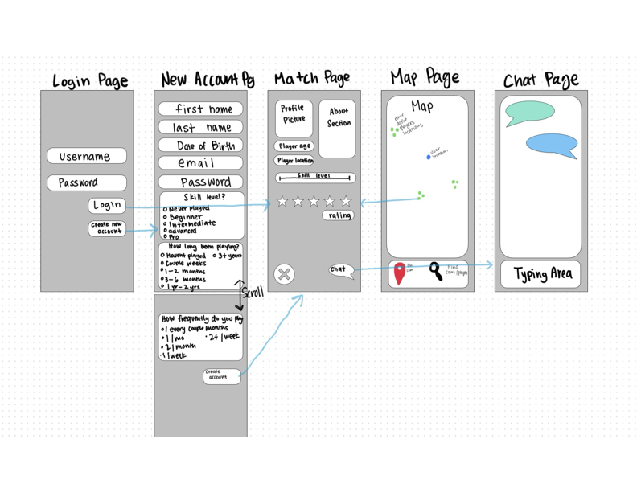

# Pickleball App

[My Notes](notes.md)

I changed this.

> [!NOTE]
>  This is a template for your startup application. You must modify this `README.md` file for each phase of your development. You only need to fill in the section for each deliverable when that deliverable is submitted in Canvas. Without completing the section for a deliverable, the TA will not know what to look for when grading your submission. Feel free to add additional information to each deliverable description, but make sure you at least have the list of rubric items and a description of what you did for each item.

> [!NOTE]
>  If you are not familiar with Markdown then you should review the [documentation](https://docs.github.com/en/get-started/writing-on-github/getting-started-with-writing-and-formatting-on-github/basic-writing-and-formatting-syntax) before continuing.

## 🚀 Specification Deliverable

> [!NOTE]
>  Fill in this sections as the submission artifact for this deliverable. You can refer to this [example](https://github.com/webprogramming260/startup-example/blob/main/README.md) for inspiration.

For this deliverable I did the following. I checked the box `[x]` and added a description for things I completed.

- [x] Proper use of Markdown
- [x] A concise and compelling elevator pitch
- [x] Description of key features
- [x] Description of how you will use each technology
- [x] One or more rough sketches of your application. Images must be embedded in this file using Markdown image references.

### Elevator pitch

Pickleball has been taking over the nation and thousands of people have begun playing the sport. But what if you don't have anyone to play with or want to meet new people? Thats where (insert app name here) comes into play. This app helps you connect with other pickleball players based on a variety of factors to help you find a well matched player, follow your friends, or just find people nearby to play with!

### Design

### Key features

- Authentication/secure login
- Shows you other pickleball players (and courts??) around you actively playing
- A ranking system that starts off based on an intro survey you fill out and continues based on game scores and other's reviews of you
- Shows you other players you might want to play with based on ranking's and locations
- A chat function that allows you to communicate with other players
- A way to follow other players (and recieve updates of their games? Or if actively playing?)

### Technologies

I am going to use the required technologies in the following ways.

- **HTML** - Correct HTML structure. A login page, create account page, a page with a map for you to find players nearby, a page for connecting with other players, a chat page.
- **CSS** - Looks pretty, works on different screens/devices.
- **React** - Lets you login, lets you follow or look at other players, record games/rate players and other react routing components.
- **Service** - Match algorithm, login/logout authentication, storing recorded game, and send chat.
- **DB/Login** - Stores recorded games, chat history, social networks, and login info.
- **WebSocket** - Live chat functionality, live locations, and reminders/friend updates (if time).

## 🚀 AWS deliverable

For this deliverable I did the following. I checked the box `[x]` and added a description for things I completed.

- [x] **Server deployed and accessible with custom domain name** - [My server link](https://pickleplay.click).

## 🚀 HTML deliverable

For this deliverable I did the following. I checked the box `[x]` and added a description for things I completed.

- [x] **HTML pages** 
        Chloe Added:
            - Login, New Account, and match pages
        Mae Added:
            - Map and Chat pages
- [x] **Proper HTML element usage**
        Chloe Added:
            - yes
        Mae Added:
            - yes
- [x] **Links**
        Chloe Added:
            - button link from login page to match page
            - button link from create account page to match page
            - button link from match page to chat page
        Mae Added:
            - button link from map page to match page
            - button links to individual chats from chat_list page
- [x] **Text**
        Chloe Added:
            - Text in Match page to display player information
        Mae Added:
            - Added headers on all my pages
- [ ] **3rd party API placeholder**
        Chloe Added:
            - Didn't add this to my pages
        Mae Added:
            - Added the map to the map page
- [x] **Images**
        Chloe Added:
            - Added Logo placeholder image to index page
            - Added profile picture placeholder image to match page
        Mae Added:
            - Added profile picture placeholder to chat page.
- [x] **Login placeholder**
        Chloe Added:
            - Added input fields for username and password on index page
        Mae Added:
            - Didn't add in my pages
- [x] **DB data placeholder**
        Chloe Added:
            - Added place for database info to populate on match page
        Mae Added:
            - Added person name and picture at the top of chat page that will come from the db
            - Added list of chats the history of which and person to whom you're chatting will come from db
- [x] **WebSocket placeholder**
        Chloe Added:
            - Added live feed placeholder for number of matches on match page
        Mae Added:
            - Added a mock point on the map that would populate based on the person's location
            - Added a placeholder for the chats that you can have with people

## 🚀 CSS deliverable

For this deliverable I did the following. I checked the box `[x]` and added a description for things I completed.

- [ ] **Header, footer, and main content body** - I did not complete this part of the deliverable.
- [ ] **Navigation elements** - I did not complete this part of the deliverable.
- [ ] **Responsive to window resizing** - I did not complete this part of the deliverable.
- [ ] **Application elements** - I did not complete this part of the deliverable.
- [ ] **Application text content** - I did not complete this part of the deliverable.
- [ ] **Application images** - I did not complete this part of the deliverable.

## 🚀 React part 1: Routing deliverable

For this deliverable I did the following. I checked the box `[x]` and added a description for things I completed.

- [ ] **Bundled using Vite** - I did not complete this part of the deliverable.
- [ ] **Components** - I did not complete this part of the deliverable.
- [ ] **Router** - I did not complete this part of the deliverable.

## 🚀 React part 2: Reactivity deliverable

For this deliverable I did the following. I checked the box `[x]` and added a description for things I completed.

- [ ] **All functionality implemented or mocked out** - I did not complete this part of the deliverable.
- [ ] **Hooks** - I did not complete this part of the deliverable.

## 🚀 Service deliverable

For this deliverable I did the following. I checked the box `[x]` and added a description for things I completed.

- [ ] **Node.js/Express HTTP service** - I did not complete this part of the deliverable.
- [ ] **Static middleware for frontend** - I did not complete this part of the deliverable.
- [ ] **Calls to third party endpoints** - I did not complete this part of the deliverable.
- [ ] **Backend service endpoints** - I did not complete this part of the deliverable.
- [ ] **Frontend calls service endpoints** - I did not complete this part of the deliverable.
- [ ] **Supports registration, login, logout, and restricted endpoint** - I did not complete this part of the deliverable.

## 🚀 DB deliverable

For this deliverable I did the following. I checked the box `[x]` and added a description for things I completed.

- [ ] **Stores data in MongoDB** - I did not complete this part of the deliverable.
- [ ] **Stores credentials in MongoDB** - I did not complete this part of the deliverable.

## 🚀 WebSocket deliverable

For this deliverable I did the following. I checked the box `[x]` and added a description for things I completed.

- [ ] **Backend listens for WebSocket connection** - I did not complete this part of the deliverable.
- [ ] **Frontend makes WebSocket connection** - I did not complete this part of the deliverable.
- [ ] **Data sent over WebSocket connection** - I did not complete this part of the deliverable.
- [ ] **WebSocket data displayed** - I did not complete this part of the deliverable.
- [ ] **Application is fully functional** - I did not complete this part of the deliverable.
