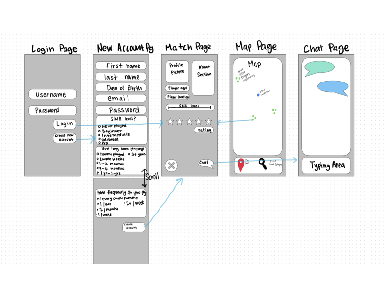

# Pickleball App

[My Notes](notes.md)

I changed this.

> [!NOTE]
>  This is a template for your startup application. You must modify this `README.md` file for each phase of your development. You only need to fill in the section for each deliverable when that deliverable is submitted in Canvas. Without completing the section for a deliverable, the TA will not know what to look for when grading your submission. Feel free to add additional information to each deliverable description, but make sure you at least have the list of rubric items and a description of what you did for each item.

> [!NOTE]
>  If you are not familiar with Markdown then you should review the [documentation](https://docs.github.com/en/get-started/writing-on-github/getting-started-with-writing-and-formatting-on-github/basic-writing-and-formatting-syntax) before continuing.

## 🚀 Specification Deliverable

> [!NOTE]
>  Fill in this sections as the submission artifact for this deliverable. You can refer to this [example](https://github.com/webprogramming260/startup-example/blob/main/README.md) for inspiration.

For this deliverable I did the following. I checked the box `[x]` and added a description for things I completed.

- [x] Proper use of Markdown
- [x] A concise and compelling elevator pitch
- [x] Description of key features
- [x] Description of how you will use each technology
- [x] One or more rough sketches of your application. Images must be embedded in this file using Markdown image references.

### Elevator pitch

Pickleball has been taking over the nation and thousands of people have begun playing the sport. But what if you don't have anyone to play with or want to meet new people? Thats where (insert app name here) comes into play. This app helps you connect with other pickleball players based on a variety of factors to help you find a well matched player, follow your friends, or just find people nearby to play with!

### Design

### Key features

- Authentication/secure login
- Shows you other pickleball players (and courts??) around you actively playing
- A ranking system that starts off based on an intro survey you fill out and continues based on game scores and other's reviews of you
- Shows you other players you might want to play with based on ranking's and locations
- A chat function that allows you to communicate with other players
- A way to follow other players (and recieve updates of their games? Or if actively playing?)

### Technologies

I am going to use the required technologies in the following ways.

- **HTML** - Correct HTML structure. A login page, create account page, a page with a map for you to find players nearby, a page for connecting with other players, a chat page.
- **CSS** - Looks pretty, works on different screens/devices.
- **React** - Lets you login, lets you follow or look at other players, record games/rate players and other react routing components.
- **Service** - Match algorithm, login/logout authentication, storing recorded game, and send chat.
- **DB/Login** - Stores recorded games, chat history, social networks, and login info.
- **WebSocket** - Live chat functionality, live locations, and reminders/friend updates (if time).

## 🚀 AWS deliverable

For this deliverable I did the following. I checked the box `[x]` and added a description for things I completed.

- [x] **Server deployed and accessible with custom domain name** - [My server link](https://pickleplay.click).

## 🚀 HTML deliverable

For this deliverable I did the following. I checked the box `[x]` and added a description for things I completed.

- [x] **HTML pages** 
        Chloe Added:
            - Login, New Account, and match pages
        Mae Added:
            - Map and Chat pages
- [x] **Proper HTML element usage**
        Chloe Added:
            - yes
        Mae Added:
            - yes
- [x] **Links**
        Chloe Added:
            - button link from login page to match page
            - button link from create account page to match page
            - button link from match page to chat page
        Mae Added:
            - button link from map page to match page
            - button links to individual chats from chat_list page
- [x] **Text**
        Chloe Added:
            - Text in Match page to display player information
        Mae Added:
            - Added headers on all my pages
- [x] **3rd party API placeholder**
        Chloe Added:
            - Didn't add this to my pages
        Mae Added:
            - Added the map to the map page
- [x] **Images**
        Chloe Added:
            - Added Logo placeholder image to index page
            - Added profile picture placeholder image to match page
        Mae Added:
            - Added profile picture placeholder to chat page.
- [x] **Login placeholder**
        Chloe Added:
            - Added input fields for username and password on index page
        Mae Added:
            - Didn't add in my pages
- [x] **DB data placeholder**
        Chloe Added:
            - Added place for database info to populate on match page
        Mae Added:
            - Added person name and picture at the top of chat page that will come from the db
            - Added list of chats the history of which and person to whom you're chatting will come from db
- [x] **WebSocket placeholder**
        Chloe Added:
            - Added live feed placeholder for number of matches on match page
        Mae Added:
            - Added a mock point on the map that would populate based on the person's location
            - Added a placeholder for the chats that you can have with people

## 🚀 CSS deliverable

For this deliverable I did the following. I checked the box `[x]` and added a description for things I completed.

- [x] **Header, footer, and main content body**
    Chloe Added:
        - Added navigation footer on inside pages (match, map, chat) (done through bootstrap in html files)
        - Added a centered header to login, newAccount, and match pages (done through bootstrap in html files)
        - Formatted main content bodies for login, newAccount, and match pages (done through bootstrap in html files).
    Mae Added:
        - Added a username and page name header for chat_list, chat, and map pages
        - Formatted main content bodies and elements for the chat_list, chat, and map pages
        - Edited the footer to point to the chat list page instead of chats
- [x] **Navigation elements** 
    Chloe Added:
        - Added navbar to bottom of match, map, and chat pages that sticks to bottom of the screen
    Mae Added:
        - Edited the footer to point to the chat list page instead of chats
- [x] **Responsive to window resizing**
    Chloe Added:
        - Made sure the following pages are responsive to resizing. I mostly did this through bootstrap in the html file mostly (did also add a header margin rule to index.css and match.css)
    Mae Added:
        - Created css for the chat_list, chat, and map pages to allow them to resize 
- [x] **Application elements**
    Chloe Added:
        - Added loading indications when button is pressed to communicate with the user
        - Grayed out and disabled the page in the navbar that the user is currently on to
        communicate current location to user
        - Cleaned up login page (made sure password input was type password to prevent it from showing)
        - Cleaned up newAccount page by making survey more clear and prettier
    Mae Added:
        - Added coloring to pages and buttons to match our logo
        - Formatted the text boxes for typing and searching on the chat and map pages using bootstrap
        - Made the buttons on the chat_list page change color and font color when hovered over
- [x] **Application text content** 
    Chloe Added:
        - Added more details to match.html using sample data.
        - Initial Survey input on newAccount page has actual survey questions and fields
    Mae Added:
        - Made the buttons on the chat_list page change color and font color when hovered over
- [x] **Application images** 
    Chloe Added:
        - Added application logo to index and newAccount pages (sized and placed it accordingly)
    Mae Added:
        - Added temporary profile photo for the player on the chat page, made it in the header and located correctly

## 🚀 React part 1: Routing deliverable

For this deliverable I did the following. I checked the box `[x]` and added a description for things I completed.

- [x] **Bundled using Vite** - We bundled all of it using and installing vite
- [x] **Components** - We converted all of our html and css pages to be using react components instead
- [x] **Router** - We are using react to route to all the pages which we use in each page to navigate to the others

## 🚀 React part 2: Reactivity deliverable

For this deliverable I did the following. I checked the box `[x]` and added a description for things I completed.

- [x] **All functionality implemented or mocked out**
    Mae Added:
        - mocked out call to chat history database
        - mock get call to get user's name and the person we're chatting with's name
        - mocked out websocket chat functionality (listening/getting and sending messages)
        - mock post/put call to send message we sent to store in the database
        - mock location tracking/api call
        - mock api get call to player database to populate the map
        - mock api call to get current/self location to determine where to orient the map
        - mock get api call to get info for a player based on their ID when we click button to navigate to match
    Chloe Added:
        - mocked out call to chat list in database
        - mocked out call to login and locally store username for display
        - mocked out call to get a new player to display on the match page
        - chats in chat_list are dynamically listed
        - footer consistency added accross internal pages
- [x] **Hooks**
    Mae Added:
        - use hook to store the retrieved chat history
        - use hook to store the message the user types
        - use hook (useRef) to help with scrolling through chat functionality
        - use a hook to refer to websocket object and within it to mimic websocket functionality
        - use hooks to store map, along with the contained retrieved player locations, current location, etc.
    Chloe Added:
        - used hook to store username upon login/create account
        - used hook to store player information on the match page
        - used hook to send chatID to chat page and populate chat data
## 🚀 Service deliverable

For this deliverable I did the following. I checked the box `[x]` and added a description for things I completed.

- [x] **Node.js/Express HTTP service** - We used Node.js and Express to implement and expose
our backend service endpoints.
- [x] **Static middleware for frontend** - We used static middleware such as exposing the public directory for
incorrect paths as well as middleware for parsing json and cookies
- [x] **Calls to third party endpoints** - We implemented calls to our third party endpoint for our map display and functionality
- [x] **Backend service endpoints** - We have working our login, logout, createAccount, restricted, match, and map endpoints.
- [x] **Frontend calls service endpoints** - We have implemented all of the endpoints indicated above in the frontend.
- [x] **Supports registration, login, logout, and restricted endpoint** - Yes, our application supports registration, login, logout, and restricted enpoints.

## 🚀 DB deliverable

For this deliverable I did the following. I checked the box `[x]` and added a description for things I completed.

- [ ] **Stores data in MongoDB** - I did not complete this part of the deliverable.
- [ ] **Stores credentials in MongoDB** - I did not complete this part of the deliverable.

## 🚀 WebSocket deliverable

For this deliverable I did the following. I checked the box `[x]` and added a description for things I completed.

- [ ] **Backend listens for WebSocket connection** - I did not complete this part of the deliverable.
- [ ] **Frontend makes WebSocket connection** - I did not complete this part of the deliverable.
- [ ] **Data sent over WebSocket connection** - I did not complete this part of the deliverable.
- [ ] **WebSocket data displayed** - I did not complete this part of the deliverable.
- [ ] **Application is fully functional** - I did not complete this part of the deliverable.
